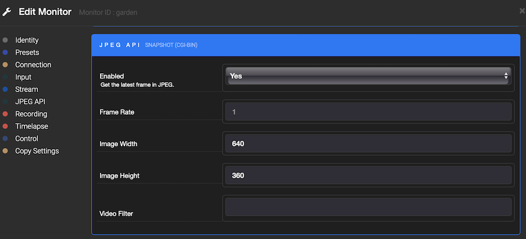

> Recently this repository was transferred to Shinobi Systems (moeiscool). We do not have complete understanding of its operation and welcome anyone to join us in maintaining it. Please send us any Pull Requests and we will present it to the community for additional review. If the overall consensus is positive (with test results) we will merge those changes.

# homebridge-shinobi
> A [Homebridge](https://github.com/nfarina/homebridge) plugin integrating [Shinobi](https://shinobi.video) for motion detector cameras

**This plugin is no longer maintained. I have moved to a superior solution using
Unifi Protect and Unifi Cameras (quite an investment) and the [Homebridge Unifi Protect plugin](https://github.com/hjdhjd/homebridge-unifi-protect).**

# Installation
1. Install Homebridge using: `npm install -g homebridge`
2. Install this plugin: `npm install -g homebridge-shinobi`
1. Update your configuration file. See a sample `config.json` snippet below.
4. Ensure `ffmpeg` is installed and on the path.

**NOTE**: Currently there is no support for streaming audio from a camera.
 
# Configuration
Example `config.json` entry:

```
"platforms": [
    {
        "platform": "Shinobi",
        "shinobi_api": "http://x.x.x.x:8080",
        "api_key": "xxx",
        "group_key": "house",
        "monitors": [
            {
                "monitor_id": "front"
            },
            {
                "monitor_id": "rear",
                "use_substream": true
            }
        ],
        "web_hook_port": "8443",
        "https_key_path": "/cert/privkey.pem",
        "https_cert_path": "/cert/fullchain.pem",
        "ffmpeg_input_args": "-fflags +genpts",
        "ffmpeg_process_args": "-vsync drop -vcodec copy -an"
    }
]
```
Where:

* `shinobi_api` is the base URL for the [Shinobi API](https://shinobi.video/docs/api)
* `api_key` is the Shinobi API key (configured in the Shinobi dashboard API menu)
* `group_key` is a Shinobi group key
* `monitors` contains a list of monitors consisting of:
    * `monitor_id`
    * `use_substream` if true will use configured sub-stream for the monitor.
* `web_hook_port` is the port that the platform should listen on for motion event webhooks from Shinobi
* `ffmpeg_input_args` are the arguments that are applied to the ffmpeg command before the `-i` flag (add `-rtsp_transport tcp` for poor network conditions)
* `ffmpeg_process_args` are the arguments that are supplied to the ffmpeg command directly after the source stream URL

If the optional properties `https_key_path` and `https_cert_path` are configured to point at HTTPS key and cert files available on the Homebridge
server the webhook server will be hosted on HTTPS.

#### Shinobi Integration

The specified `shinobi_api` and `api_key` will be used to make all Shinobi API requests.

Each of the specified `monitor` IDs will be used with the specified `group_key` to add a new accessory
to the platform consistent of a Motion Sensor service and camera.

When viewing video, the plugin will use the information returned from the API for a specific Monitor to determine
the source video stream to use with the following logic:

```
if use_substream == false
  if direct stream URL found in monitor config
    use direct stream URL
  else
    use the first proxy provided by shinobi in monitor config
else
  if direct sub-stream URL found in monitor config
    use direct sub-stream URL
  else
    integrate with the [Shinobi Dynamic Substream Functionality](https://hub.shinobi.video/articles/view/xm9HJFXI1XITt1y)
    use the first proxy provided by shinobi in monitor config
```

FFmpeg is used to stream from the determined source and forward to HomeKit. If possible, the video will not be re-encoded.

If the dynamic sub-stream functionality is in use, the plugin will:

```
on CONNECT:
  check substream enable state and toggle to on if required   

on DISCONNECT:
  check substream enable state and toggle to off if required   
```

Snapshot images for each Monitor are simply pulled from the Shinobi API. To ensure these are available, enable the JPEG API for
each configured Monitor:



A webhook URL should be configured for each Monitor within the Shinobi 'Global Detector Settings' with the following format:

`http[s]://<homebridge_ip>>:<web_hook_port>?mid=<monitors[index].monitor_id>&group=<group_key>` 

For example, assuming the Homebridge instance is available at 192.168.1.10 and using the above sample config,
the two Monitors `front` and `rear` would have webhook URLs configured as:  

`https://192.168.1.10:8443?mid=front&group=house` 

and

`https://192.168.1.10:8443?mid=rear&group=house` 

# Help etc.

If you have a query or problem, raise an issue in GitHub, or better yet submit a PR!

